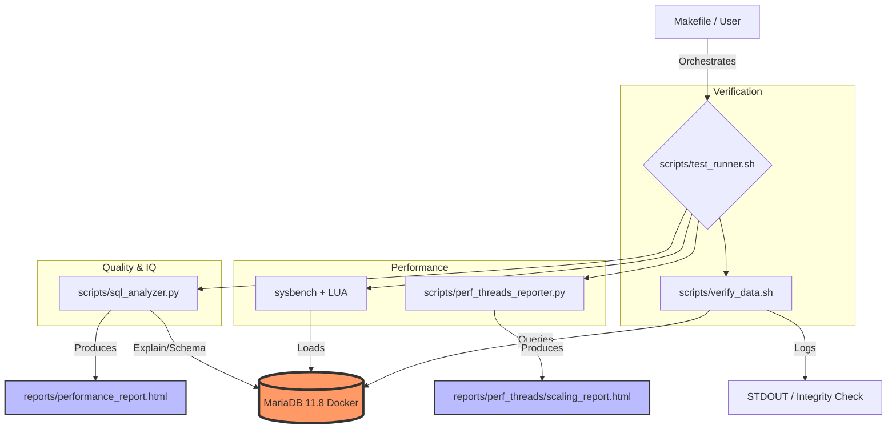

# 🛠️ Database Performance & Analysis Tools Guide

This guide provides a comprehensive overview of the tools available in this repository for Mariadb performance testing, data verification, and query analysis.

## 📊 Overview of Tools

The project orchestrates several specialized tools to measure different aspects of database performance and health.

| Tool | Primary Purpose | Key Measured Metrics |
| :--- | :--- | :--- |
| **Sysbench (LUA)** | Load testing & Benchmarking | QPS, TPS, Latency (avg, max, 95th) |
| **SQL Analyzer** | Query-level deep dive | Execution time, `EXPLAIN` plan, Index efficiency |
| **Verify Data** | Data Integrity | Row counts, Table Checksums |
| **Perf Threads Reporter** | Scalability Analysis | Performance scaling from 1 to 64 threads |
| **Interactive Runner** | User Experience | All-in-one execution with live HTML dashboards |

---

## 🏎️ Sysbench Metrics: Understanding the Numbers

When running `make bench` or `make perf-threads`, Sysbench provides several critical metrics:

### 1. Throughput (The "Speed")

- **QPS (Queries Per Second):** The total number of SQL queries executed per second. Higher is better.
- **TPS (Transactions Per Second):** The number of complete LUA script executions per second. In our case, one transaction corresponds to executing the entire set of queries in `employees/req_employees.sql`.

### 2. Latency (The "Responsiveness")

- **Avg Latency:** The average time it takes for a request to complete.
- **95th Percentile:** 95% of queries were faster than this value. This is a much better indicator of "real-world" performance than the average, as it excludes the best-case scenarios and focuses on the "tail" latency.
- **Max Latency:** The absolute slowest request. High max latency usually indicates resource contention or background system activity.

### 3. Efficiency

- **Events:** The total number of times the test script was executed.
- **Total Time:** How long the test ran in total.

---

## 📈 Scalability & Thread Comparison

Using `make perf-threads`, you can measure how MariaDB scales as more users (threads) connect simultaneously.

### What to Look For

- **Linear Scaling:** Ideally, 2 threads should give twice the QPS of 1 thread.
- **The "Knee" (Saturation Point):** The point where adding more threads no longer increases QPS, or even decreases it. This usually identifies the CPU core count limit or I/O bottleneck.
- **Latency Increase:** As threads increase, "Wait" time increases. Monitoring the gap between Average and 95th percentile latency helps identify lock contention.

---

## 🔍 SQL Query Analysis & Analytics

The `scripts/sql_analyzer.py` tool (run via `make analyze`) provides a deep clinical look at your SQL queries.

### Metrics & Measurements

- **Individual Execution Time:** Precise measurement of how long a single query takes to run on the live dataset.
- **EXPLAIN Analysis:**
  - **ALL (Full Table Scan):** The "silent killer" of performance. The database reads every row in the table.
  - **Using temporary/filesort:** Indicates the engine is creating internal tables on disk/memory to sort data, which is very slow for large datasets.
  - **Index Utilization:** Shows which indexes are actually being used (`key` column in EXPLAIN).

### Intelligent Suggestions

The tool automatically scans the `information_schema` to identify missing indexes on columns used in `WHERE`, `GROUP BY`, and `ORDER BY` clauses. It generates the exact `CREATE INDEX` SQL needed to fix the issue.

---

## 🏗️ Technical Architecture

The following diagram illustrates how the tools interact with the MariaDB container and each other:

---

## 🎓 Educational Note

This environment is designed for **Training and Learning**. By observing the difference between a query with an index and one without, or seeing how the 95th percentile latency spikes as threads increase, you gain a practical understanding of database internals that goes beyond theory.
