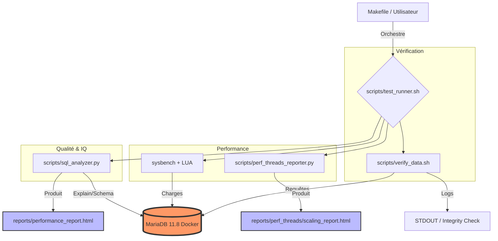

# 🛠️ Guide des Outils de Performance et d'Analyse de Base de Données

Ce guide offre une vue d'ensemble complète des outils disponibles dans ce dépôt pour les tests de performance MariaDB, la vérification des données et l'analyse des requêtes.

## 📊 Présentation des Outils

Le projet orchestre plusieurs outils spécialisés pour mesurer différents aspects de la performance et de la santé de la base de données.

| Outil | Objectif Principal | Métriques Clés Mesurées |
| :--- | :--- | :--- |
| **Sysbench (LUA)** | Tests de charge & Benchmarking | QPS, TPS, Latence (moyenne, max, 95ème) |
| **SQL Analyzer** | Analyse approfondie des requêtes | Temps d'exécution, plan `EXPLAIN`, efficacité des index |
| **Verify Data** | Intégrité des Données | Nombre de lignes, Checksums des tables |
| **Perf Threads Reporter** | Analyse de Scalabilité | Évolution des performances de 1 à 64 threads |
| **Interactive Runner** | Expérience Utilisateur | Exécution assistée avec tableaux de bord HTML en direct |

---

## 🏎️ Métriques Sysbench : Comprendre les Chiffres

Lors de l'exécution de `make bench` ou `make perf-threads`, Sysbench fournit plusieurs métriques critiques :

### 1. Débit (Le "Speed")

- **QPS (Queries Per Second) :** Le nombre total de requêtes SQL exécutées par seconde. Plus c'est élevé, mieux c'est.
- **TPS (Transactions Per Second) :** Le nombre d'exécutions complètes du script LUA par seconde. Dans notre cas, une transaction correspond à l'exécution de tout l'ensemble de requêtes de `employees/req_employees.sql`.

### 2. Latence (La "Réactivité")

- **Latence moyenne (Avg Latency) :** Le temps moyen nécessaire pour qu'une requête aboutisse.
- **95ème Centile (95th Percentile) :** 95 % des requêtes ont été plus rapides que cette valeur. C'est un bien meilleur indicateur de la performance "réelle" que la moyenne, car il exclut les cas idéaux et se concentre sur les latences de "queue".
- **Latence Max :** La requête la plus lente. Une latence max élevée indique généralement une saturation des ressources ou une activité système en arrière-plan.

### 3. Efficacité

- **Events :** Le nombre total de fois où le script de test a été exécuté.
- **Total Time :** La durée totale du test.

---

## 📈 Comparaison des Threads et Scalabilité

Avec `make perf-threads`, vous pouvez mesurer comment MariaDB réagit lorsque plusieurs utilisateurs (threads) se connectent simultanément.

### Ce qu'il faut observer

- **Scalabilité Linéaire :** Idéalement, 2 threads devraient donner deux fois plus de QPS qu'un seul thread.
- **Le "Genou" (Point de Saturation) :** Le point où l'ajout de nouveaux threads n'augmente plus les QPS, voire les diminue. Cela identifie généralement la limite du nombre de cœurs CPU ou un goulot d'étranglement E/S.
- **Augmentation de la Latence :** À mesure que les threads augmentent, le temps d'attente augmente. Surveiller l'écart entre la latence moyenne et le 95ème centile aide à identifier les conflits de verrouillage (lock contention).

---

## 🔍 Analyse des Requêtes SQL

L'outil `scripts/sql_analyzer.py` (via `make analyze`) fournit un examen clinique approfondi de vos requêtes SQL.

### Métriques & Mesures

- **Temps d'exécution individuel :** Mesure précise du temps mis par une seule requête sur le jeu de données réel.
- **Analyse EXPLAIN :**
  - **ALL (Full Table Scan) :** Le "tueur silencieux" de performance. La base de données lit chaque ligne de la table.
  - **Using temporary/filesort :** Indique que le moteur crée des tables internes sur disque ou en mémoire pour trier les données, ce qui est très lent pour les grands jeux de données.
  - **Utilisation des Index :** Montre quels index sont réellement utilisés (colonne `key` dans EXPLAIN).

### Suggestions Intelligentes

L'outil analyse automatiquement le schéma (`information_schema`) pour identifier les index manquants sur les colonnes utilisées dans les clauses `WHERE`, `GROUP BY`, et `ORDER BY`. Il génère le SQL `CREATE INDEX` exact pour corriger le problème.

---

## 🏗️ Architecture Technique

Le diagramme suivant illustre comment les outils interagissent avec le conteneur MariaDB :

---

## 🎓 Note Pédagogique

Cet environnement est conçu pour la **Formation et l'Apprentissage**. En observant la différence entre une requête avec index et une sans, ou en voyant comment le 95ème centile de latence explose avec l'augmentation des threads, vous acquérez une compréhension pratique des mécanismes internes des bases de données qui dépasse la simple théorie.
